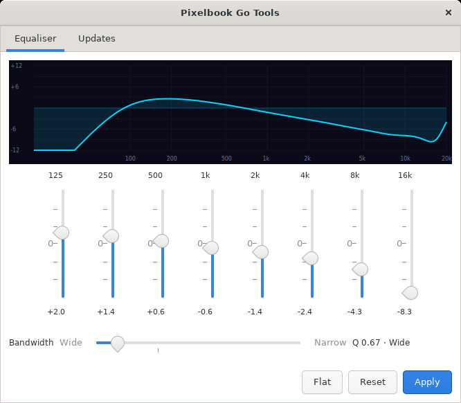
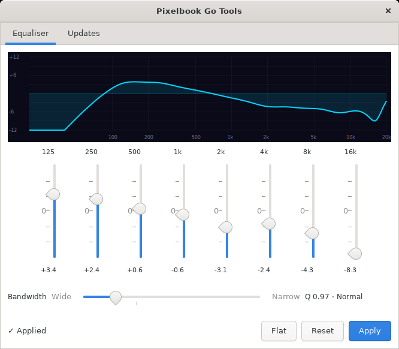
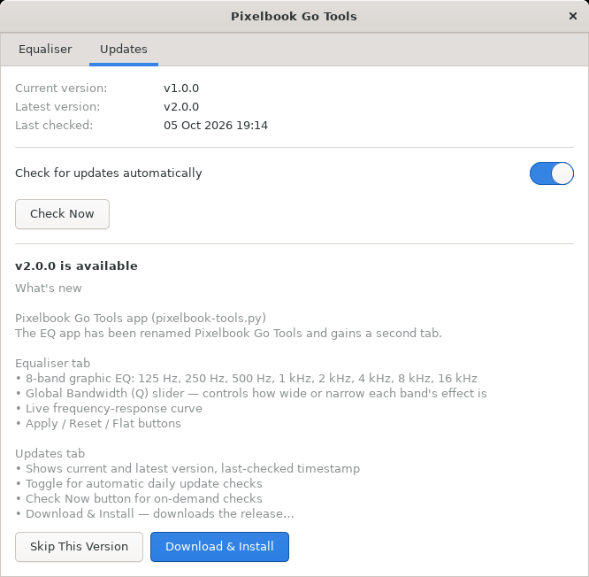
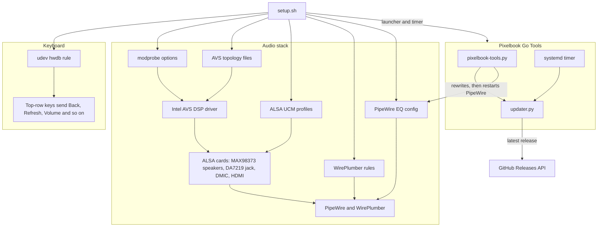
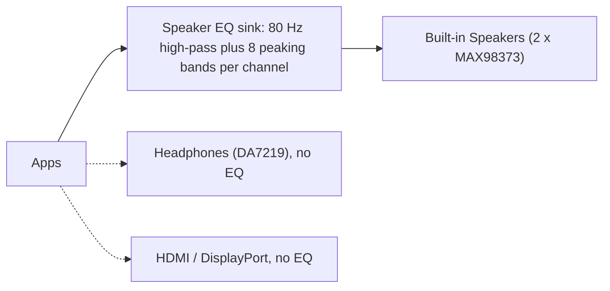

# Pixelbook Go (Atlas) Linux Setup

Fixes the keyboard hotkeys and gets the internal audio working on the **Google Pixelbook Go** (board codename **Atlas**) running Ubuntu 24.04 or Zorin OS 18.x with kernel 6.17 or newer.

It is for anyone who has swapped ChromeOS for MrChromebox UEFI firmware and an Ubuntu-based distro, and found that the top-row keys send plain F1 to F10 and that the speakers, headphone jack and microphones do nothing. One script, `setup.sh`, installs everything. It also installs **Pixelbook Go Tools**, a small GTK4 app for adjusting the speaker EQ and for automatic updates (in case I add to this).

The fixes are written for real Pixelbook Go hardware. They change kernel module options, firmware files and the audio stack, so do not run `setup.sh` on any other machine.

## Screenshots

These were taken in an Ubuntu 24.04 Docker container, not on a Pixelbook. The container ran real PipeWire 1.0.5 and WirePlumber 0.4.17 with simulated audio devices (null sinks named like the Pixelbook's speaker, HDMI and microphone nodes), so the speaker EQ loaded and **Apply** took effect as it would on the laptop. The keyboard and audio fixes themselves can only be seen on the real hardware.



*Equaliser tab with the default speaker curve that `setup.sh` installs.*

<table>
<tr>
<td width="50%"></td>
<td width="50%"></td>
</tr>
<tr>
<td><em>After moving a few sliders and pressing Apply. The config is rewritten and PipeWire restarts with the new gains.</em></td>
<td><em>Updates tab. For this shot the copy's <code>version.txt</code> was set to 1.0.0 (demo data), so the real v2.0.0 release on GitHub shows as an update.</em></td>
</tr>
</table>

## What it fixes

### Keyboard

The Pixelbook Go's top-row ChromeOS keys send plain F1 to F10 by default. This remaps them to their labelled functions at the kernel level, so it works on both Wayland and X11:

| Key | Mapped to |
|-----|-----------|
| Back (←) | `XF86Back` |
| Refresh (↺) | `XF86Refresh` |
| Fullscreen | `F11` |
| View Windows | `XF86LaunchA` (GNOME Overview) |
| Brightness Down | `XF86MonBrightnessDown` |
| Brightness Up | `XF86MonBrightnessUp` |
| Play/Pause | `XF86AudioPlay` |
| Mute | `XF86AudioMute` |
| Volume Down | `XF86AudioLowerVolume` |
| Volume Up | `XF86AudioRaiseVolume` |

**Keyboard backlight:** `Alt + Brightness Down/Up` adjusts the keyboard backlight with the GNOME on-screen display.

### Audio

The Pixelbook Go uses the Intel AVS (Audio/Voice/Speech) driver with:

- **MAX98373** × 2: internal speakers (Class D amps over I2S/SSP0)
- **DA7219**: headphone jack output and headset microphone
- **DMIC**: internal microphone array

The stock `linux-firmware` package (as of early 2024) is missing the KBL AVS topology files. This installs known-working July 2024 topology files and configures the full audio stack:

| Component | What it does |
|-----------|--------------|
| `modprobe/snd-avs.conf` | Forces the Intel AVS DSP driver and disables firmware version checks |
| `firmware/*.bin` | AVS topology files for MAX98373, DA7219, DMIC and HDMI audio |
| `ucm/avs_max98373/` | UCM profile: sets DSP volume and stereo channel routing, balances both speaker amps |
| `ucm/avs_da7219/` | UCM profile: enables the headphone DAC path and headset mic on jack detection |
| `wireplumber/` | Prioritises the built-in speakers over HDMI and labels devices properly |
| `pipewire/99-speaker-eq.conf` | 8-band PipeWire filter-chain EQ routed to the speakers only |

### Speaker EQ

A PipeWire filter-chain applies an 8-band graphic EQ to the built-in speakers. HDMI audio and headphones are unaffected. The default curve is meant to make the speakers sound closer to how they did under ChromeOS (I believe Google uses a software EQ), but you will probably want to adjust it, which you can do in **Pixelbook Go Tools**. To bypass the EQ, pick the non-EQ output (**Built-in Speakers**) in GNOME's sound settings.

## Pixelbook Go Tools

A GTK4 desktop app, added to your applications menu by `setup.sh`.

**Equaliser tab:** adjust the speaker EQ without touching config files.

- 8 bands: 125 Hz, 250 Hz, 500 Hz, 1 kHz, 2 kHz, 4 kHz, 8 kHz and 16 kHz (±9 dB each)
- **Bandwidth** slider, which controls how wide or narrow each band's effect is (Q 0.3 to 4.0)
- Live frequency-response curve
- **Apply**, **Reset** (back to the last applied settings) and **Flat** buttons

**Updates tab:** manage updates.

- Shows the current version, the latest release and when it last checked
- Toggle for automatic daily update checks (the first one runs 5 minutes after boot)
- **Check Now** for on-demand checks
- **Download & Install** downloads the release and runs its `setup.sh` in a terminal
- **Skip This Version** hides a specific release

## Requirements

- Google Pixelbook Go (board codename **Atlas**)
- Ubuntu 24.04 or Zorin OS 18.x (or another Ubuntu 24.04-based distro)
- Kernel **6.17** (the AVS topology files in `firmware/` are tested against this kernel; others may work but are unsupported)
- MrChromebox coreboot firmware (standard UEFI boot)
- GNOME desktop (for the keyboard backlight shortcut and the app)
- For Pixelbook Go Tools: Python 3 with the GTK4 and Cairo bindings. Most Ubuntu and Zorin desktops already have them; if the app fails to start, install them with:

  ```bash
  sudo apt install python3-gi python3-gi-cairo gir1.2-gtk-4.0
  ```

> **Kernel note:** The included topology `.bin` files are from linux-firmware commit `65d14b1` (July 2024). Newer kernel versions may include updated topology files in the `linux-firmware` package that work out of the box. If audio stops working after a kernel upgrade, try re-running this script.

## Usage

On the Pixelbook Go:

```bash
git clone https://github.com/LBSiUK/pixelbook-go-linux
cd pixelbook-go-linux
chmod +x setup.sh
./setup.sh
# Reboot when prompted
```

Run it as your normal user, not with `sudo`: it asks for your password when it needs it, and the PipeWire, GNOME and systemd parts are installed for your user. The script is safe to re-run after reinstalls or kernel upgrades, but re-running it (including through **Download & Install**) puts the speaker EQ back to the default curve, so note your settings first.

To open Pixelbook Go Tools without the menu:

```bash
python3 pixelbook-tools.py
```

The app opens on any Ubuntu 24.04 desktop, which is handy for looking around, but only press **Apply** on the Pixelbook: it writes the speaker EQ into your PipeWire config and restarts PipeWire, and on other hardware that adds a "Speaker EQ" output pointing at a device that does not exist.

### What the script does

1. Asks whether to enable automatic update checks
2. Installs `/etc/udev/hwdb.d/61-pixelbook-go-keyboard.hwdb` and reloads the hwdb, so the keyboard remapping takes effect immediately
3. Installs `/etc/modprobe.d/snd-avs.conf` (takes effect after a reboot)
4. Copies the topology `.bin` files to `/lib/firmware/intel/avs/`
5. Installs the UCM configs to `/usr/share/alsa/ucm2/conf.d/avs_max98373/` and `.../avs_da7219/`
6. Installs the WirePlumber rules to `/etc/wireplumber/main.lua.d/`; if WirePlumber is running, restarts it and sets the ALSA mixer state
7. Installs the PipeWire EQ config to `~/.config/pipewire/pipewire.conf.d/`; if PipeWire is running, reloads it and sets the Speaker EQ virtual sink as the default output
8. Sets GNOME keyboard shortcuts for the keyboard backlight (`Alt + Brightness`)
9. Installs the update-checker systemd service and timer to `~/.config/systemd/user/`, and enables the timer if you chose automatic updates
10. Installs a desktop entry for **Pixelbook Go Tools** to `~/.local/share/applications/`

### After rebooting

- **Speakers** work automatically as the default output (routed through the EQ)
- **Headphones** appear as an output device when plugged in (no EQ applied)
- **Headset mic** appears as an input when a headset is plugged in
- **Internal mic** (DMIC) is always available as an input
- **HDMI audio** works when an external display is connected (lower priority than the speakers)
- **Pixelbook Go Tools** appears in your applications menu

### Checking the scripts

There are no automated tests, and the fixes can only really be tested on the laptop. These quick checks catch syntax errors (`shellcheck` currently reports only info-level SC2015 notes):

```bash
bash -n setup.sh
shellcheck setup.sh
python3 -m py_compile pixelbook-tools.py updater.py
```

## How it works



**Keyboard.** The hwdb rule matches the laptop by its DMI strings (`svnGoogle:pnAtlas`) and maps the scancodes of the ten top-row keys to Linux key codes. Because this happens in udev, below the display server, it works the same on Wayland and X11.

**Audio.** `snd-avs.conf` tells `snd-intel-dspcfg` to use the AVS driver (`dsp_driver=4`) and stops it rejecting the firmware version. The AVS driver loads a topology file for each codec from `/lib/firmware/intel/avs/`, which describes the DSP pipelines, and creates one ALSA card per codec. The UCM profiles then set the mixer controls at boot and when a device is switched on or off (for example the headphone path on jack detection). WirePlumber's rules raise the speakers above HDMI, fix their format at S16LE/48 kHz and give the devices readable names.

The speaker EQ is a PipeWire filter-chain. It adds a virtual sink called "Speaker EQ" with a higher priority than the speakers themselves, so it becomes the default output, and each channel runs through an 80 Hz high-pass filter (to protect the small speakers) and eight peaking filters before it reaches the speaker node. Its output is pinned to the speakers, so headphones and HDMI never go through it:



**Pixelbook Go Tools.** The Equaliser tab reads the current gains and bandwidth back out of `~/.config/pipewire/pipewire.conf.d/99-speaker-eq.conf`, draws the combined response of all the filters (standard biquad formulas at 48 kHz), and on **Apply** writes a fresh config and restarts `pipewire` and `pipewire-pulse`. The Updates tab and the systemd timer both use `updater.py`, which asks the GitHub Releases API for the latest release at most once a day while automatic checks are on, and keeps its state in `~/.config/pixelbook-go-tools/`. When there is something new, the timer sends a desktop notification. **Download & Install** downloads the tagged release, unpacks it into `~/.local/share/pixelbook-go-tools/releases/v<version>/` and runs that copy's `setup.sh` in a terminal, so the app launcher and timer then point at the new copy.

### Project layout

```
pixelbook-go-linux/
├── setup.sh                          main setup script
├── README.md                         this file
├── version.txt                       current version number
├── pixelbook-tools.py                GTK4 EQ and update manager app
├── updater.py                        GitHub Releases update checker (used by the app and systemd)
├── docs/screenshots/                 screenshots used in this README
├── firmware/
│   ├── max98373-tplg.bin             speaker amp AVS topology
│   ├── da7219-tplg.bin               headphone codec AVS topology
│   ├── dmic-tplg.bin                 internal microphone AVS topology
│   └── hda-8086280b-tplg.bin         HDMI audio AVS topology
├── modprobe/
│   └── snd-avs.conf                  DSP driver selection
├── pipewire/
│   └── 99-speaker-eq.conf            8-band PipeWire filter-chain EQ
├── systemd/
│   ├── pixelbook-go-tools-update.service   update checker service (one-shot)
│   └── pixelbook-go-tools-update.timer     daily trigger (5 min after boot, then every 24 h)
├── udev/
│   └── 61-pixelbook-go-keyboard.hwdb top-row key remapping
├── ucm/
│   ├── avs_max98373/                 speaker amp UCM profile
│   │   ├── AVS I2S MAX98373.conf
│   │   └── HiFi.conf
│   └── avs_da7219/                   headphone codec UCM profile
│       ├── AVS I2S DA7219.conf
│       └── HiFi.conf
└── wireplumber/
    └── 51-pixelbook-go-audio.lua     WirePlumber device priority rules
```

## Status and limitations

- Tested on a Pixelbook Go with Ubuntu 24.04 / Zorin OS 18.x and kernel 6.17. Other kernels may work but are not supported.
- The WirePlumber rules use the Lua format of WirePlumber 0.4, which is what Ubuntu 24.04 and Zorin OS 18 ship (0.4.17). WirePlumber 0.5 and later no longer read Lua config, so on newer distros the speaker priority and device names from `wireplumber/` would not apply.
- Re-running `setup.sh`, including through **Download & Install**, resets the speaker EQ to the default curve.
- If a `linux-firmware` update replaces the files in `/lib/firmware/intel/avs/` and audio stops working, re-run `setup.sh`.

## Credits

- The AVS topology files in `firmware/` come from the [linux-firmware](https://git.kernel.org/pub/scm/linux/kernel/git/firmware/linux-firmware.git) project (commit `65d14b1`), where they are published under the Apache-2.0 licence.
- [MrChromebox](https://mrchromebox.tech/) provides the UEFI firmware that makes running a standard Linux distro on the Pixelbook Go possible.
